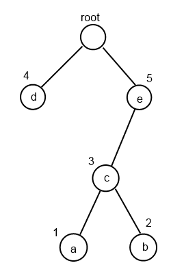
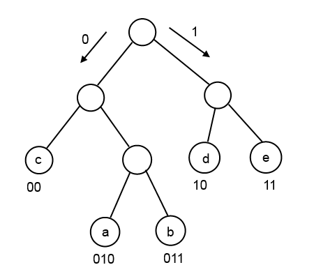

Title: 哈夫曼树及哈夫曼编码
Date: 2014-06-16 13:00
Category: 学习
Tags: 哈夫曼树, 哈夫曼编码, 算法
<!-- Slug:  -->
Author: Hanbin
<!-- Summary: 第一篇日志 -->

哈夫曼(又称霍夫曼, David Albert Huffman， 1925 ~ 1999, 美国人)于  
1952年攻读麻省理工博士学位时提出哈夫曼编码，至今仍广泛适用于数据压缩领域。  

哈夫曼树
========
哈夫曼树是哈夫曼编码的基础，又称最优二叉树。  
有如下特点：  

* 二叉树  
* 节点有权值  
* 离根节点越近的节点权值也越大  

如下图，a b c d e 的权值分别为 1 2 3 4 5，权值大的节点越靠近根。  

  

这样一来，从根节点出发到达权值大的节点所用路径较短，到达权值小的节点所用路径较长。  
就好像越重要的越常用的东西就越要带在身边一样。  
  
  
哈夫曼编码
=========

哈夫曼编码首先是一种编码，即将数据以另一种事先约定的格式存储。  
其次哈夫曼编码是一个常用于数据压缩的，无损的编码方式。  

提炼一下它的特点：  

* 有压缩特性  
* 无损 (保存信息熵,即不丢失信息量)  
* 变字长编码
* 前缀编码  

形象一点的说明就是利用一段比特数值取代原有的二进制数据。  
为实现压缩性，元信息中出现频率高的字元用较短的比特数值取代，  
相对的以较长的比特数值取代元信息中出现频率低的字元。  
如何定义这个比特数值呢，就用到了哈夫曼树。  

举个例子对比一下编码前后的数据量。  
对字符串 **eeeeeddddcccbba**  进行存储，  
普通情况下，为区分a b c d e这五个字元，至少需要三位二进制数值，  
假设 **a: 001; b: 010; c: 011; d: 100; e: 101**.  
原字串写成二进制形式即为：  
**101 101 101 101 101 100 100 100 100 011 011 011 010 010 001**  

同样，用哈夫曼树对 a b c d e进行编码，根据出现的频率确定各字元权值分别为：  
a: 1; b: 2; c: 3; d: 4; e: 5.  
构造如下哈夫曼树：  

  

(由于哈夫曼编码是变字长的前缀编码，各字元码长不同，且任意字元的编码不能是另一字元的前缀，  故对应哈夫曼树的构建方法请参考文末。)  

根据哈夫曼树，得到各字元哈夫曼编码为：  
**a: 010; b: 011; c: 00; d: 10; e: 11**.  

原字串经过哈夫曼编码后的二进制数据为：  
**11 11 11 11 11 10 10 10 10 00 00 00 011 011 010**  

可见哈夫曼编码后二进制数据长度由45位减少到33位，确实有数据压缩效果。  
(数据内容，字元总量等环境因素影响到压缩率)

用于哈夫曼编码的哈夫曼树构建
=========================

摘抄的方法：
### 构成初始集合  
对给定的n个权值{W1,W2,W3,...,Wi,...,Wn}构成n棵二叉树的初始集合**F**={T1,T2,T3,...,Ti,...,Tn}，其中每棵二叉树Ti中只有一个权值为Wi的根结点，它的左右子树均为空。（为方便在计算机上实现算法，一般还要求以Ti的权值Wi的升序排列。）  
### 选取左右子树  
在**F**中选取两棵根结点权值最小的树作为新构造的二叉树的左右子树，新二叉树的根结点的权值为其左右子树的根结点的权值之和。  
### 删除左右子树  
从**F**中删除这两棵树，并把这棵新的二叉树同样以升序排列加入到集合**F**中。  
### 重复二和三两步  
重复二和三两步，直到集合**F**中只有一棵二叉树为止。  
### 由哈夫曼树获得哈夫曼编码  
可自行规定左节点为0， 右节点为1。当然左节点规定1，右节点规定为0也可以。  
  
  
  
以上。

