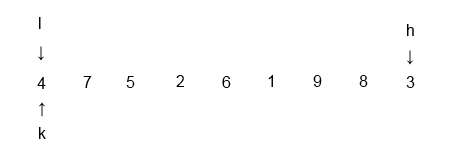
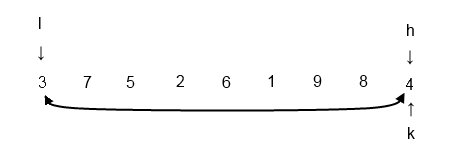
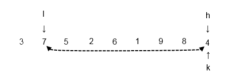
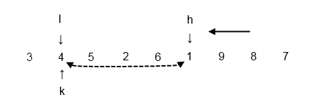
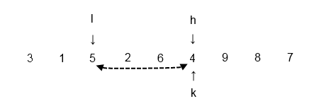
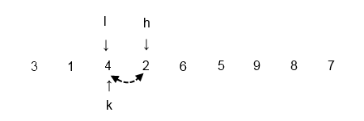
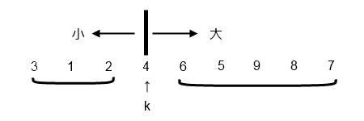
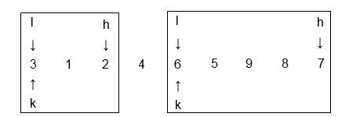

Title: 快速排序算法
Date: 2014-07-23 23:00
Category: 学习
Tags: 快速排序, 算法
<!-- Slug:  -->
Author: Hanbin
<!-- Summary: 第一篇日志 -->

  
概述
====
  
快速排序算法(Quick Sort)由C. A. R. Hoare(托尼.霍尔)于1960年提出。  
C. A. R. Hoare，1934年出生于英国，攻读了牛津大学学士学位和莫斯科大学统计学(博士学位?)  
快速排序算法属于分治算法的一种，首先向将序列分成两各集合，  
一个集合中的数据都要大于另一个集合的数据。  
再对分割后的集合进行同样操作，直到集合不可分割为止。    


特性
====
  
* 平均时间复杂度： n*log(n)  
* 最差时间复杂度： n^2  
* 最优时间复杂度： n*log(n)  
* 空间复杂度： n  
* 不稳定排序  


实现思想
=======
  
从待排序序列中选择参考变量，将比该变量值小的元素都移动至该变量左侧，  
大的值都移动至该变量右侧。一次处理后，参考变量左边的值都比该变量小，  
即将待排序分成了大小两个集合。再分别对左右子序列进行同样操作。  
  

代码实现
=======
  
代码实现时要牢记三个要素：序列**起点l**,**终点h**及**参考点k**。  
1 首次处理时，起点与终点即为待排序序列的起点与终点，参考点可任意选择。  
本文参考点选择与起点相同。  

  

2 比较l所指的值与k值的大小，大则与k交换位置，小则右移一位继续比较。  
  
3 比较h所指的值与k值的大小，小则与k交换位置，大则左移一位继续比较。  

  
  
  
  
  
  
4 重复上述过程，直到l大于等于k且h小于等于l(序列的下标)，则完成一次处理。  
  
  

5 对生成的左右两个集合进行上述同样的步骤，直到子集合不可再排序为止。    

  


代码如下：  

[C]

```
#include <stdio.h>

int sort(int* arr, int l, int h)
{
	int i;
	int j;
	int k;
	int tmp;

	i = l;
	j = h;
	k = i;

	while (i < j)
	{
		while (j > k)
		{
			if (arr[j] < arr[k])
			{
				tmp = arr[j];
				arr[j] = arr[k];
				arr[k] = tmp;
				k = j;
				break;
			}
			else
			{
				j --;
			}
		}

		while (i < k)
		{
			if (arr[i] > arr[k])
			{
				tmp = arr[i];
				arr[i] = arr[k];
				arr[k] = tmp;
				k = i;
				break;
			}
			else
			{
				i ++;
			}
		}
	}

	return (k);
}

void quicksort(int* arr, int l, int h)
{
	int k;

	if (l < h)
	{
		k = sort(arr, l, h);
		quicksort(arr, l, k-1);
		quicksort(arr, k+1, h);
	}
}

void main()
{
	int i;
	int arr[9] = {4,7,9,2,6,1,5,8,3}; 
	int length;

	length = sizeof(arr)/sizeof(arr[0]);
	quicksort(arr, 0, length);

	for (i=0;i<length;i++)
	{
		printf("%d\r\n",arr[i]);
	}

	getchar();
}
```
  
  
以上。

