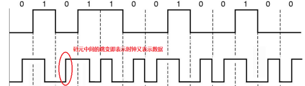
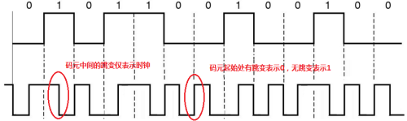

Title: 曼彻斯特编码及差分曼彻斯特编码
Date: 2014-07-25 19:00
Category: 学习
Tags: 曼彻斯特编码, 通信原理
<!-- Slug:  -->
Author: Hanbin
<!-- Summary: 第一篇日志 -->

曼彻斯特编码(Manchester Encoding)也叫相位编码(Phase Encode，简写PE),  
是一个同步时钟编码技术。信号自身包含同步频率。  
因其在曼彻斯特大学产生并发展，故至今仍称为曼彻斯特编码。  
产生时间大约在1948到1949年之间或更早(未查到准确数据，但曼彻斯特编码首先用来在
曼彻斯特马克1号电脑上存储数据到磁鼓上，而曼彻斯特马克1号电脑大约运行于1948至1949年间)。  
  
曼彻斯特编码
===========
  
### 特性  

* 数据流中包含数据与时钟信号，故具有自同步特性  
* 每一二进制码中都有以电平跳变，即每个码元被调成两个电平    
* 不归零码  
* 数据传输速率为调制速率的50%  
  
### 编码图形  

  
  
### 表示约定  

曼彻斯特编码以电平跳动来表示数据，存在两种情况：  

> a.由低电平到高电平的跳变表示数据0  
  b.由高电平到低电平的跳变表示数据0

权威资料中对电平跳动约定并没有统一的结论，因此实际使用中视具体情况而定。  

### 应用现状  

待补充。  
  
  
差分曼彻斯特编码
===============

作为曼彻斯特编码的改进型，差分曼彻斯特编码与曼彻斯特编码具有相近的特性。  
唯一区别是数据的表示形式。  
曼彻斯特编码中，以码元中间电平跳变方向来表示数据。  
差分曼彻斯特编码中以码元开始时是否有电平跳变来表示数据。  
即，曼彻斯特编码中码元中间的跳变即携带了时钟信息，又表示了数据。  
而差分曼彻斯特编码中码元中间的跳变仅携带时钟信息，数据信息存储在码元开始部分。  

### 编码图形  

  
  
### 表示约定

通常情况下，约定**码元起始位置有电平跳变表示0，无跳变则表示1**。  
**起始位**比较特殊，电平必须要从中间电平变到高电平或低电平，约定：**电平由低到高表示0，反之表示1。**  

### 对比

差分曼彻斯特编码与曼彻斯特编码有相近的特性，但由于电平是否跳变来表示数据，故可能电平条变次数相对较少。  

### 应用现状  

待补充。  
  

以上。

