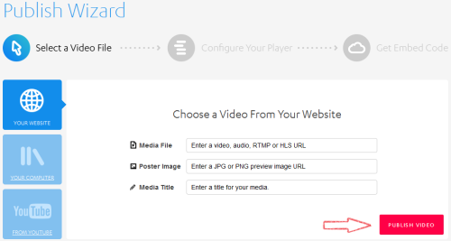
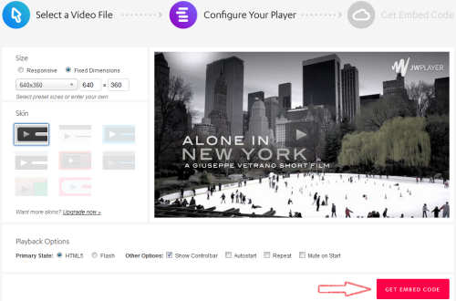
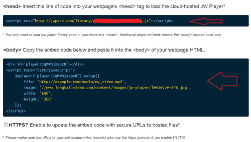
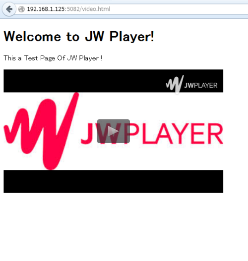
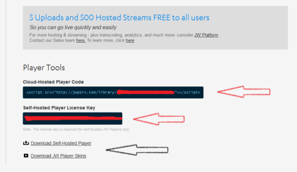

Title: JW Player - Red5 弄る
Date: 2014-09-11 20:00
Category: 整理
Tags: 流媒体
<!-- Slug:  -->
Author: Hanbin
<!-- Summary: 第一篇日志 -->

  


## JW Player  
  
JW Player是一个在线媒体播放器,可以利用Adobe Flash或HTML5来  
在线播放FLV、H264(AVC)编码的MP4等，可免费使用（右上角会有水印），  
作为一个成熟产品，后续支持也非常丰富，具体可参加见官方网页：  
[http://support.jwplayer.com/](http://support.jwplayer.com/)  

## 在自己的网页中播放视频  
  
打开 [http://www.jwplayer.com/sign-up/](http://www.jwplayer.com/sign-up/)  
填入邮箱，点击获取按钮，随后将会收到确认邮件。  
确认并注册成功后将出现如下窗口：    
  
  
点击“PUBLISH A VIDEO NOW”按钮进入如下界面：  
  
  
左面的“YOUR WEBSITE”,“YOUR COMPUTER”,“FROM YOUTUBE”  
是指音视频或图片文件的来源，  
以“YOUR WEBSITE”为例，右半部分分别用来指定  
音视频文件的URL， 播放前的起始画面， 名字。  
填入的目的是用来生成代码，这里可以全部空白，稍后在代码中修改。  
点击“PUBLISH VIDEO”按钮来到下面的界面：  
   
  
这里可以指定播放器的大小和皮肤等参数，也可以在代码中修改，  
点击“GET EMBED CODE”就可以生成我们定制的代码了。如下图：  
   
  
在自己网页的Hade，Body中分别加入上述代码，重新载入试试看吧。  
  

很简单对吧！  

## 下载到本地  
  
上述生成的代码实际上是调用了JWPlayer放在云端的播放器，  
当然也可以将它下载到本地。  
先打开上文第一张图片所在的页面，  
点击“Get Your Player”,出现如下页面，  
  
  
分别给出了在线播放器调用地址，本地播放器使用的许可，本地播放器下载地址。  
下载解压后放到服务器中，并在网页中指定播放器地址与许可即可。  

```
head:  
<script type="text/javascript" src="./jwplayer/jwplayer.js"></script>
<script type="text/javascript">jwplayer.key="你的本地播放器使用许可";</script>

body:  
<div id="myElement">Loading the player...</div>
<script type="text/javascript">
    jwplayer("myElement").setup({
        file: "./media/test.mp4",
        image: "./media/image.jpg"
    });
</script>
```


本文环境：  
Debian 7.3  
Nginx 1.6  
JW Player 6.10  
Red5 1.0  
  
以上。  
