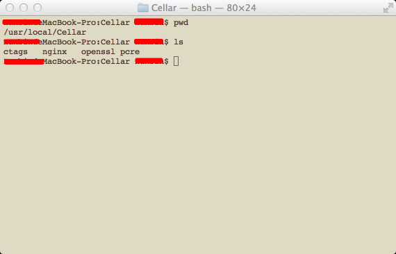

Title: Mac软件包管理工具-Homebrew
Date: 2014-12-11 21:00
Category: 整理
Tags: Mac, Homebrew
<!-- Slug:  -->
Author: Hanbin
<!-- Summary: 第一篇日志 -->
  
  
----
mac买了好久，光用来看视频了，最近想用来做点东西什么的，  
竟然发现没有wget工具，安装一下吧。  
(有更为强大的curl工具，但貌似不能完全取代wget，比如递归?)  
自己下载编译麻烦费时，应该会有类似apt，yum的工具吧。  
查了下，常用的有MacPorts，Fink，homebrew等。  
看了介绍，MacPorts会额外安装依赖包，不使用系统自身的资源。  
https://www.macports.org/  
Fink好像用的人不多，可能因为维护不及时。  
http://www.finkproject.org/  
Homebrew有很多人推荐，尝试一下吧。  
http://brew.sh/  
当然这些都是支持二进制安装的，不然太慢啦。  

----
Homebrew的安装很简单，根据主页介绍，一条ruby语句就行。  
安装完成后  
使用“brew　search”命令来查看收录的应用。  
使用“brew　install　xxxx”命令来安装应用。  
使用“brew　uninstall　xxxx”命令来安装应用。  
  
所有应用都会被安装到“/usr/local/Cellar/”路径下，  
方便查看和整理。喜欢干净，规矩的东西^_^    
   
  
Homebrew自身的干净卸载，可能需要下面的操作：  
```
cd `brew --prefix`  -- 进入Homebrew目录  
rm -rf Cellar  -- 删除代管理的工具  
brew prune  -- brew自身卸载命令  以下为一些糕咪清理。  
rm `git ls-files`
rmdir Library/Homebrew Library/Aliases Library/Formula Library/Contributions
rm -rf .git
rm -rf ~/Library/Caches/Homebrew 
rm -rf ~/Library/Caches/Homebrew
rm -rf ~/Library/Logs/Homebrew
rm -rf /Library/Caches/Homebrew
```
  
先用着，有啥问题再记下来。  

20141211   
  
周末去二川^_^!     