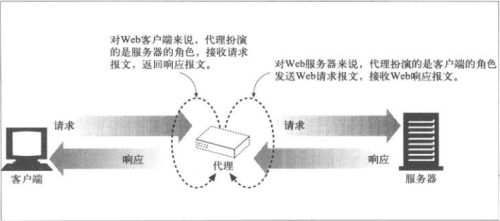
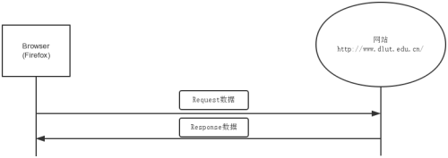
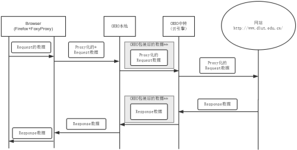
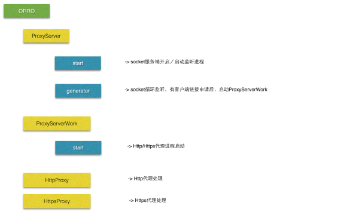

Title: 学习写个代理工具-ORRO (1)
Date: 2014-12-16 21:00
Category: 项目
Tags: ORRO, 代理, Python
<!-- Slug:  -->
Author: Hanbin
<!-- Summary: 第一篇日志 -->
  
  
----
  
#####项目托管在https://github.com/lixingke3650/ORRO  
#####包含以下几篇文章  

> 学习写个代理工具-ORRO (1)　　－　起因，构成  
> 学习写个代理工具-ORRO (2)　　－　学习到的HTTP头知识  
> 学习写个代理工具-ORRO (3)　　－　部署  
  

----
### 代理  
  
在网页加速，科学上网等时候经常会碰到代理这个词，  
代理就是好像是一个中转站，如果从大连没有直飞到    
深圳的飞机，或者航班数较少，那么可以借由北京中转一下。  
  
网络上的代理也是一样，从你个人的节点无法到达要访问的  
节点，或你们之间直连的速度较慢时，就可借助另外一个  
中转节点来实现互通。  
  
代理的思想很易懂，但具体到场合，工具，用途等，会  
出现很多种实现方法。  

最近自己以科学上网为目标学习写一个代理工具，将过程和用到的  
知识记录如下。  
  
----
### ORRO  
  
ORRO，我给起的名字，目标是成为一个Http代理工具。  
实现方法和Goagent大致相同，以云引擎为中转。  
云引擎支持的语言不算多，常见的Java，Python，Ruby这几种。  
选Python吧。没Java那么臃肿，语言风格也大体比较喜欢，关键还很强大。  
(就是觉得self比较麻烦)  
因为是网页代理，可能Http协议用的比较多，提前掌握一下比较好。  
编写代码与测试环境很重要。  
Sublime Text2，UI漂亮用起来非常顺畅，用来做代码编辑器。  
测试环境本地使用Firefox+FoxyProxy+Python2.7.8,  
云引擎使用OpenShift，免费，功能也多。  
不过云端上传代码费时，调试也不方便，  
自己搭一个Python　Web服务器吧。  
(Debian7.3+Nginx1.6.0+Gunicorn19.1.1+Python2.7.3)  
工欲善其事，必先利其器。开发与调试环境真的很重要^_^  

OK，开工。  
  
----
### 总体印象  
  
关于代理服务器的理解，HTTP权威指南上有这样一个易懂的图：  
(如侵犯到您的版权，请联系我。)  
  
可以看到，无论客户端还是服务端，都没有必要知道中间是否经过了代理，  
也就是说，代理内部无论怎样处理，只要保证入口和出口的一致性即可。  
  
看下图(借用母校的网址来说明)，  
   
正常的网站访问流程很简单，直接由浏览器发出请求，  
网站服务器接到请求后，返回结果即可。  
(当然中间会经过各种传输层，网络层啊等概念，不过http代理工作在应用层，  
基本不涉及下层协议)  
  
加入代理后，流程稍显复杂，需要注意的有以下几点：  
1.  
首先原始的请求信息会被加上代理的标志(由浏览器自身或FoxyProxy完成)后  
发送出去。  
这里说的代理标志主要是指Http头信息的请求地址会改写为完整路径。  
2.  
数据被发往本地的ORRO服务。  
本地ORRO接到数据后，做一些私有的格式化处理，比如加密什么的，  
然后发送到远端的ORRO服务，即云引擎上的ORRO服务。  
理论上本地ORRO与远端ORRO之间可以完全自由的对数据进行私有格式处理，  
但由于远端ORRO服务要存放在云引擎上面，受到云引擎的限制，因此  
在这里本地ORRO与远端ORRO之间以Http的形式进行通信。  
3.  
远端ORRO服务接到数据后进行去格式化处理，比如解密什么的，  
获得原始的请求信息，并从中提取出目标网站的网络地址，为后续建立连接做好准备。  
4.  
远端ORRO服务向目标网站(服务器)发出请求并获取应答，  
对应答进行私有格式处理后，返回给本地ORRO。  
5.  
本地ORRO接到数据后去格式化处理，返回给浏览器等本地应用。  
  
### 本地ORRO服务
  
经上述分析可以知道，ORRO服务需要本地和云端(远端)两个部分组成。  
本地服务接受浏览器等应用发送来的请求，并转发给远端ORRO。  
(后面都以Firefox+FoxyProxy作为本地应用来说明)  
等待并接收Firefox+FoxyProxy请求需要一个Socket　Server，  
而访问远端ORRO需要一个Socket　Client。  
  
  
#### 本地Socket　Server  
  
给定本地IP地址打开端口并监听即可。  
本地IP通常指定为127.0.0.1，  
端口在1024到65535之间，并与其他应用不冲突即可。  
(0~1024大部分为系统或保留端口，还是别碰为好)  
以访问大连理工大学的主页为例，来分析一下Http请求。  
  
抓取Http请求头如下：  
>GET http://www.dlut.edu.cn/ HTTP/1.1
>Host: www.dlut.edu.cn
>User-Agent: Mozilla/5.0 (Windows NT 6.1; rv:34.0) Gecko/20100101 Firefox/34.0
>Accept: text/html,application/xhtml+xml,application/xml;q=0.9,*/*;q=0.8
>Accept-Language: ja,en-us;q=0.7,en;q=0.3
>Accept-Encoding: gzip, deflate
>Connection: keep-alive
  
**对于GET请求，本地ORRO服务并不关心内容，打包发送给云端ORRO即可。**  

>POST http://www.dlut.edu.cn/xuexiaogaikuang/ssjg.jsp?wbtreeid=1002 HTTP/1.1
>Host: www.dlut.edu.cn
>User-Agent: Mozilla/5.0 (Windows NT 6.1; rv:34.0) Gecko/20100101 Firefox/34.0
>Accept: text/html,application/xhtml+xml,application/xml;q=0.9,*/*;q=0.8
>Accept-Language: ja,en-us;q=0.7,en;q=0.3
>Accept-Encoding: gzip, deflate
>Referer: http://www.dlut.edu.cn/
>Cookie: JSESSIONID=9C61B7FB977EEA60CACCD7656CE06F78
>Connection: keep-alive
>Content-Type: application/x-www-form-urlencoded
>Content-Length: 76
>  
>Find=find&entrymode=1&INTEXT2=YWE%3D&news_search_code=&wbtreeids=0&INTEXT=aa

**对于POST请求，本地ORRO服务读取并转发完头部信息后还要读取转发Body信息，  
而Body的长度需要根据头部的Content-Length字段来确定。**  
  
在ORRO系统中，使用HTTP　POST将上述收到的请求发送到远端服务器。  
以上述GET请求为例，经ORRO包装后发送给远端的数据如下：  
  
>POST http：//orro_remote.com/ORRO_HTTP/ HTTP/1.1  
>Host: orro_remote.com  
>Connection: keep-alive  
>Content-Length: 311  
  
>GET http://www.dlut.edu.cn/ HTTP/1.1  
>Host: www.dlut.edu.cn  
>User-Agent: Mozilla/5.0 (Windows NT 6.1; rv:34.0) Gecko/20100101 Firefox/34.0  
>Accept: text/html,application/xhtml+xml,application/xml;q=0.9,*/*;q=0.8  
>Accept-Language: ja,en-us;q=0.7,en;q=0.3  
>Accept-Encoding: gzip, deflate  
>Connection: keep-alive  
  
ORRO头部的Content-Length是请求内容全部数据的大小，也是本次POST的body的大小。  
远端服务可以完整的取到请求内容。  

另外，无论GET还是POST，头部中Connection字段的处理都非常重要。  
Connection是服务端与客户端之间是否保持Socket长连接的标志。  
如果是本地代理，那么该标志可以与Firefox+FoxyProxy的请求头内容完全一致，  
但ORRO的远端服务是运行在云端的，也就是说socket的连接是难以把控的，  
初期的ORRO会将此标志主动设为close，即完成一次请求并返回结果后，ORRO将关闭  
与Firefox+FoxyProxyhe连接。新的请求将产生新的socket连接。  
  
不管怎样看，Http头处理都是不可避免的。  
于是写了一个Http头处理工具，  
(https://github.com/lixingke3650/ORRO/blob/master/Local/Tool/HttpHead.py)  
可以获取指定字段值，删除字段，增加字段，更改字段等。  
  
Firefox+FoxyProxy发出的请求并不同步，同一时间可能会有大量连接到来。  
多线程处理是必不可少的。  
组织结构如下图：  
   
  
  
#### 本地Socket　Client  
  
访问云端的ORRO服务可以有两种方法：  

>以访问web服务器的形式，可以利用现有的各类工具  
>用最基本的socket来访问  
  
ORRO采用第二种方法，因为本身只有POST一种方式，  
且没有复杂的参数，采用socket还可以实现精确的控制。  
从配置文件中取得远端ORRO的Host与端口(云服务器可能只开放了80端口来解析各类脚本)  
接收到Firefox+FoxyProxy请求后即连接远端Socket发送数据。  
远端数据接收处理后发送给Firefox+FoxyProxy，并断开与远端Socket的连接。  
  
### 需要注意的地方  
  
#### 请求的URL  
  
通常情况下，请求的URL如下：  

>GET / HTTP/1.1  
>Host: www.dlut.edu.cn

而Firefox+FoxyProxy会在使用完整的URL：  
  
>GET http://www.dlut.edu.cn/ HTTP/1.1  
>Host: www.dlut.edu.cn  
  
大部分网站对上述两种写法都会返回正确的结果，  
但个别网站会出现问题，  
经个人测试百度与优酷对完整的URL会返回错误。  
(也可能是个人的测试问题，  
标准协议中请求URL是不含有前面的Host信息的。)  
  
因此，要去掉Firefox+FoxyProxy请求中的完整URL信息。  
  

#### Http头  

Http代理对Http头信息是有相当敏感性的，  
不同的头部可能对应了代理服务器的不同动作。  
ORRO虽然与一个完整的代理服务器还有相当大的差距，  
但仍然不可避免的要处理一些头信息。  
这些将在[写个代理工具-ORRO(2)]中来介绍。    

  
以上。  
20141216   
  
海阔凭鱼跃，天高任鸟飞。         