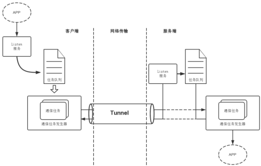

Title: 网络安全通信隧道-OrTunnel
Date: 2015-03-03 22:00
Category: 项目
Tags: tunnel, SSL, TLS, RC4, OrTunnel
<!-- Slug:  -->
Author: Hanbin
<!-- Summary: 第一篇日志 -->
  
  
----
  
网络安全这个东西，  
说他重要可在某些时候都感觉不到他的存在；  
说他不重要可在某些时候却能要了我们的命。  
  
OrTunnel为不具有安全传输的应用增加了  
在网络上安全传输数据的功能。  
  
代码托管在  
[https://github.com/lixingke3650/OrTunnel][1]  

----
  
### 起因  
  
在写代理工具[ORRO][2]时,发现本地服务器与远程服务器  
之间的通信是明文的，这在科学上网的时候很容易被绊。  
代理失败不说还很容易被封端口封IP。  
开始时打算在代理内部增加加解密的功能，后来想了一想，  
单独做成一个工具可能更易去学习理解，  
也不至于使ORRO变得臃肿而失去继续下去的兴致。  
于是学习写了一个安全传输隧道工具-OrTunnel。  
  
### 调查
  
之前工作中使用C和OpenSSL写过网络安全通信方面的项目，  
对SSL有过一些了解，所以首先想到的是用SSL来实现安全隧道。  
SSL协议是一系列安全通信的约束，我们也可以直接使用加密算法  
加密数据，这样更有助于理解安全通信的过程。  
  
### 概要/参数
  
我希望这个工具写完以后不但可以学习，增长知识，也能真正的去使用他。  
所以稳定性与性能也被考虑了进去。  
  
  
  
> 多线程，多条隧道可同时通信  
> 提供SSL/TLS加密通信方式  
> 提供RC4加密通信方式  
  
本想加入socket断线检测功能，后来觉得即便不加入OrTunnel，  
也会存在因网络状况导致的断线，所以若通讯中发生断线则如实的  
传递给应用，由应用重新发起链接比较好。  
实现语言：Python，实现平台：Python支持的平台。  
  
### 实现过程  
  
分客户端与服务端两部分实现。  
两部分的内部处理大致相同。  

#### 客户端  
  
客户端分为 ** 监听服务 ** 和 ** 通信服务 ** 两部分。  

** 监听服务 ** 启动后监听端口，发现有应用发起的链接，  
实例化一个作业任务，设置该应用链接的socket，  
并将该作业任务加入作业任务队列。  

** 通信服务 ** 启动后阻塞读取作业任务队列，  
发现新任务则新建线程连接服务端，开始数据交换。  
主线程将作业任务从作业任务队列中删除，  
继续阻塞读取作业任务队列。  
  
** 加解密 ** 处理可根据设定文件指定的方式来进行，  
读取到应用的数据好先加密，在发往服务端，  
读取到服务端数据后，先解密在发往应用。  
  
#### 服务端  
  
服务端处理与客户端相似。  
主要区别就是SSL认证。  
目前OrTunnel采用的是客户端认证的方式，  
服务端不认证客户端的合法性。  

### 注意项  
  
除了SSL通信外，还实现了RC4加密通信，好处就是加解密速度快，  
消耗资源少。  
起初利用PyCrypto这个第三方库来实现，  
后来总是随机性的出现乱码，  
于是查资料自己实现，结果仍然是乱码。  
不过实现RC4加密的过程中知道加密解密用的密钥SBox是  
随加解密过程而动态变化的，  
如果网络通信中出现socket分包粘包的情况，  
原有的处理会出现加解密密钥不同步的情况，进而导致解密失败。  
修改以后PyCrypto和自己实现的RC4加解密模块都可以稳定工作。  
  
### 后续  
  
暂无。
  
  
以上。  
20150303   
  
敌人是强大的，我们唯有比他更强大才能战胜他；  
敌人是顽固的，我们唯有比他更顽固才能战胜他；  
敌人是狡黠的，我们唯有比他更狡黠才能战胜他；  
敌人是无耻的，好吧，3比1我们赢了。  
  
[1]: https://github.com/lixingke3650/OrTunnel
