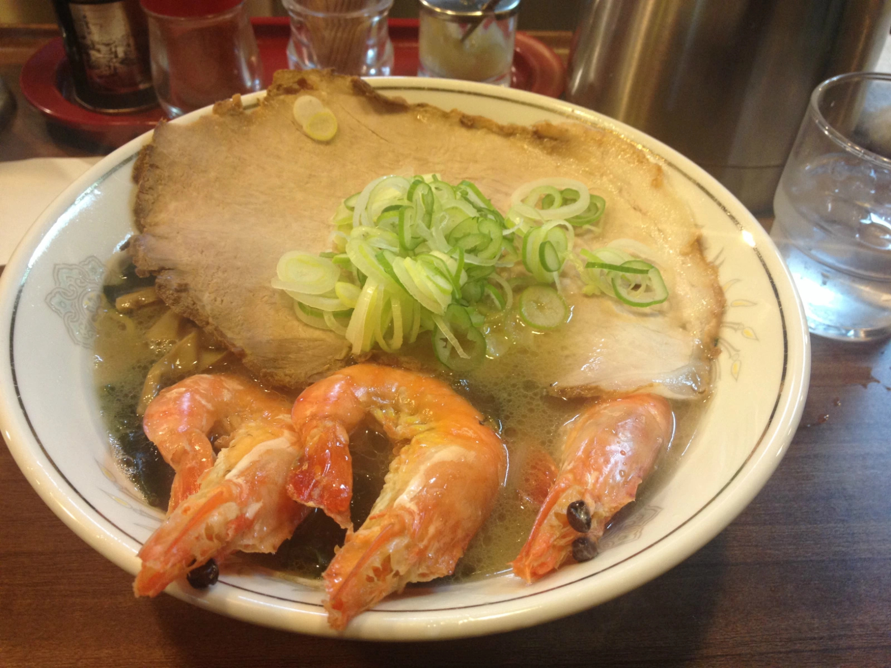
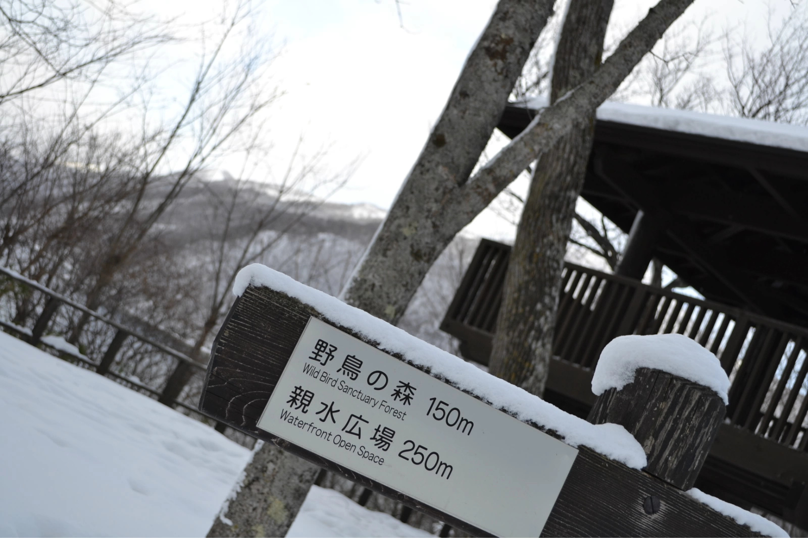

2013告别旅行
##############

:title: 2013告别旅行
:date: 2013-12-28 09:00
:category: 日记
:tags:
:author: Hanbin

2013告别旅行
==============

20131228
--------

元旦休假，游北海道去。
原定早上9点从梅田出发，结果昨天忘年会喝的稍多，早上实在爬不起来。还好一个人的旅行，自己说了算。
磨蹭到10点半终于坐上了电车。
大体计划这样，28号先到东京，休息一晚29号起来逛逛日本首都，晚上做夜行电车继续北行，
大约经过一天时间，30号晚到达函馆（北海道最南边的城市），31号到札幌，在那过个年，3号回大阪。

28号行程

车票是JR的青春18，简单说下这个，11500日圆可以坐五天，一天之内不限次数。
也就是说平均来看从大阪到东京只花了2300日圆，很便宜。不过相应的急行跟新干线坐不了，所以只能费些时间啦。

第一站米原，本打算去北海道看雪的，结果刚过京都地上就有零星积雪，到了米原已经是已经是茫茫一片白了。
不过还好没影响交通，过了大桓天气转晴地上也没了积雪。

京都的雪

路过名古屋的时候想起了孙XX，之前打招呼说又来日本了，要去大阪找我来着，最后也不知来了没有。

丰桥车站

从丰桥车站向外张望，已经没积雪了。丰田，丰桥的兄弟们，这一年可还好啊，很是怀念去年的元旦。

丰桥继续向北经浜松到热海的这一段路没座，站了两个多小时，下面是从车里拍的富士山，拍的不够好，没啥美感。

车拍富士山

终于到新宿了，第一个印象，这里到处都是绿色，第二个印象，有些乱。

新宿车站

哈哈，这个都听说过吧，图片不是很清楚，嗯，歌舞伎町，看了看，也没什么不一样的地方，可能初来乍到，不得其法吧。

日本地小人多是出了名的，从旅店就可见一半，这就是传说中的 カブセルホテル。擦，看着这么像棺材呢。
不过大浴池还是很舒服的。哈，洗洗睡觉，太累了。

20131229
--------

听着此起彼伏的呼噜声，凑合了一夜。
29号，在巴桑的案内下，游了东京。猥琐的巴桑怕惹桃花，不准爆照。不过听说目前单身，有意的请速联系。
首选的地方是东大，不愧为文艺青年啊。

东大

大部分都是老建筑，找了个专业相关的工学部楼，沾点名校气。

.. figure:: ./resource/img/2013gblx/009.jpeg
    :alt: No Image

东大

一圈下来没发现记有校名的牌匾，可能是注重内涵吧。
离开东大，来到皇居。东京古时称江户，还是老名字好听些，就像旧时的金陵跟现在的南京。

守卫皇居的是这个家伙，想起魔神坛斗士了。。。

皇居喷泉

皇居守卫

再来一张东京塔吧。

东京塔

拜别小b，晚上11点15的夜行JR。这趟车坐的真是惊险，名字叫“ムーンライトえちご”。
之前说的青春18是可以用的，不过该列车是全车指定席，就是说除了车票以外，还需要单独买个座位票。
大过年的日本人也要回家是不，现买自然是没票了，没票就上不了车，错过了，后面预定的旅店和行程全要变。
看来怎么说也得上去，想点办法吧。

夜行JR

车始发新宿，终到新泻。中间经过高崎、长冈等。
买票的时候发现从新宿到新泻的票卖完了，但从新宿到高崎是有票的，也就是说有些乘客是从高崎上车。
那就先买到高崎吧，就像国内春运高峰期，人多车少还能都守规矩吗，混混就过去了。
上车才发现，到高崎的这段路上，确实没一个人站着，列车长每40分钟左右巡视一趟，看来之前的想法是不行了。
但有利的是乘务员就一人，六列车厢他也照顾不过来吧。到了高崎，假装下去买水，在车门关之前上车。车启动以后即便发现了他也不能赶你下车了。
以此行事，在车厢连接处站了会果然列车长来了，我把从新宿到高崎的指定席票拿在手里，终点挡住，有意无意的让他看到。
不管终点到哪，车票是一个样子的，列车长瞟了一眼票后笑着说，怎么不回去坐着啊，这儿这么冷。。。哈哈 列车长好人啊，就这样早上5点，顺利抵达新泻。

ムーンライトえちご

20131230
--------

TO青森

继续赶路。从新泻到函馆，需要转六趟车，有些站转车只有两三分钟的间隙。途经的秋田、青森是大站，比较繁华，也有酒田这样的小站连吃饭的地都找不到。
秋田站等了差不多一个小时，吃了塩ラーメン，发现随身带的电子词典没电了，又出去买了电池。风好大。
酒田站换车间隙出去走了走，地上都是化了一半的雪，还捡到一串钥匙。。。
回来后拿出笔记本给手机充电。可怜没有移动电源。

酒田

继续乘车，一路上大部分是沿着日本海，天气不好风浪有些大。

日本海某处

到达本州岛最北的青森已经是晚上5点多了，必须乘坐“スーパー白鳥”经津轻海峡才能到达北海道。
我开始以为这趟列车不属于青春18票可乘坐的范围，为了尽量减小花销，先从青森用青春18坐到蟹田，再从蟹田换乘“スーパー白鳥”到木古内，然后在换乘普通列车。
但后来听说从蟹田到木古内的“スーパー白鳥”竟然是可以利用青春18的。。。白花2000日元了。
函馆是北海道最靠南的城市，不过依然感到了雪国的寒冷。

函馆

20131231
--------

旅馆要比在东京住的胶囊好多了，一早起来逛了下旅店附近的市场。

螃蟹

行进北海道

函馆到扎幌的车做起来舒服多了，几乎没什么人，沿途经过的小站也很温馨，唯一要注意的是千万别错过发车时间，车太少错过一班那今天就别想走了。

温馨沿途

13年最后一天，终于到达扎幌啦。

札幌駅

札幌街头

第一个印象是道路比较宽敞，城市给人很新的感觉。
奇怪的是这里的红绿灯，一般见到的十字路口都是同一方向的车和人同时通过和停止，这的红绿灯是人车分离的，一个十字路口先是左右的车通过过，然后是前后的车通过，最后车辆全部停止，人才开始通过。
不知说明白没有，总之等起来很费时间，不清楚出于什么目的这样设计。

哈，旅店很不错，干净整齐。唯一不足的是网比较慢，传个图片总是失败。在这里住三天。

札幌旅店

20140101
--------

新年第一天，跟着日本习俗，去拜了北海道神宫。

北海道神宫

求保佑

.. figure:: .//resource/img/2013gblx/026.jpeg
    :alt: No Image

絵馬

背面写上新一年心愿，让神宫里各路神仙保佑实现。

一群絵馬

雪下得也太大了吧，眼睛都睁不开。

风雪

北海道的海产品和拉面比较有名（怎么感觉日本各地拉面都有名。。。） ，吃了碗，有点咸。

ラーメン

20140102
--------

扎幌第二天，游支笏湖。先到千岁，然后乘公交到支笏湖，一天只有三趟，8点、11点、15点左右大概，去之前要算好时间。

支笏湖

即便阴天，也阻挡不了这犀利的拍照技术。

犀利支笏湖

支笏湖很漂亮，夏天应该别有一番景色吧。
趁着还有时间，又去了趟小樽。下车没多久又开始下雪。手机都自动关机了。

小樽

小城，据说有北欧风情。运河边上的建筑不精致不宏伟，但确有别样的感觉。

小樽河岸

20140103
--------

该回去了，六天下来，大部分时间是在坐车，不过依然看到了很多。
感慨不知是否还有机会再来的同时，是否应该认识到，其实再美好的旅行也终有结束的时候，与其怀念不如憧憬着下一次，只要你肯，总会有另一番景色在前面等着你。生活也是这样。
启程回大阪。

去北海道之前调查了很多交通方式。青春18应该是最便宜的了，顺利的话11500日元从大阪到扎幌后还会剩余一天。
需要注意的是新宿到新泻的夜行电车指定席，以及经过津轻海峡时要选择蟹田到木古内的スーパー白鳥。
再就是换乘时抓紧时间，一部装着导航的手机还是很有必要的。哦，青春18的发售是有时间段的，好像一年只有三个期间可用。
回程选择的是peach航空，千岁到大阪只需17000左右，很便宜了。
关于交通如果有想以同样方式去的同学可以参考一下。（沿路遇到了很多以同样方式旅行的朋友）

这么多天下来，印象最深的不是北海道的螃蟹也不是支笏湖与小樽的景色，反而是途经的各个小站，可能过程才更加重要吧。

得意一枚

