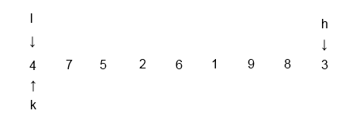
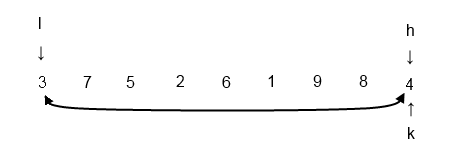
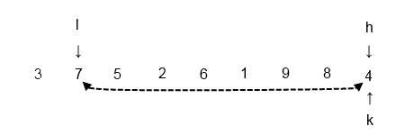
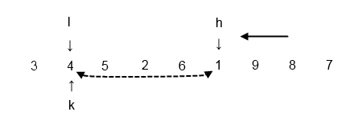
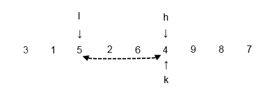
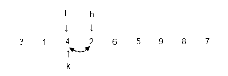
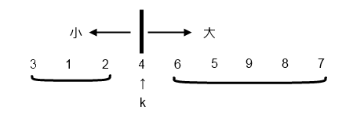
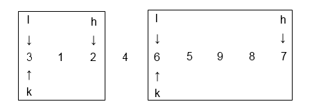

快速排序算法
############

:title: 快速排序算法
:date: 2014-07-23 23:00
:category: 学习
:tags: 快速排序, 算法
:author: Hanbin

概述
====
  
**快速排序算法(Quick Sort)由C. A. R. Hoare(托尼.霍尔)于1960年提出。  
C. A. R. Hoare，1934年出生于英国，攻读了牛津大学学士学位和莫斯科大学统计学(博士学位?)**

快速排序算法属于分治算法的一种，首先向将序列分成两各集合，  
一个集合中的数据都要大于另一个集合的数据。  
再对分割后的集合进行同样操作，直到集合不可分割为止。    

特性
====
  
* 平均时间复杂度： n*log(n)  
* 最差时间复杂度： n^2  
* 最优时间复杂度： n*log(n)  
* 空间复杂度： n  
* 不稳定排序  

实现思想
========
  
从待排序序列中选择参考变量，将比该变量值小的元素都移动至该变量左侧，  
大的值都移动至该变量右侧。一次处理后，参考变量左边的值都比该变量小，  
即将待排序分成了大小两个集合。再分别对左右子序列进行同样操作。  
  

代码实现
========
  
代码实现时要牢记三个要素：序列的 **起点l** , **终点h** 及 **参考点k** 。

1 首次处理时，起点与终点即为待排序序列的起点与终点，参考点可任意选择。
本文参考点选择与起点相同。  

2 比较l所指的值与k值的大小，大则与k交换位置，小则右移一位继续比较。  
  
3 比较h所指的值与k值的大小，小则与k交换位置，大则左移一位继续比较。  

  
4 重复上述过程，直到l大于等于k且h小于等于l(序列的下标)，则完成一次处理。  

5 对生成的左右两个集合进行上述同样的步骤，直到子集合不可再排序为止。    

代码如下：  

[C]

.. code-block:: C

    #include <stdio.h>

    int sort(int* arr, int l, int h)
    {
        int i;
        int j;
        int k;
        int tmp;

        i = l;
        j = h;
        k = i;

        while (i < j)
        {
            while (j > k)
            {
                if (arr[j] < arr[k])
                {
                    tmp = arr[j];
                    arr[j] = arr[k];
                    arr[k] = tmp;
                    k = j;
                    break;
                }
                else
                {
                    j --;
                }
            }

            while (i < k)
            {
                if (arr[i] > arr[k])
                {
                    tmp = arr[i];
                    arr[i] = arr[k];
                    arr[k] = tmp;
                    k = i;
                    break;
                }
                else
                {
                    i ++;
                }
            }
        }

        return (k);
    }

    void quicksort(int* arr, int l, int h)
    {
        int k;

        if (l < h)
        {
            k = sort(arr, l, h);
            quicksort(arr, l, k-1);
            quicksort(arr, k+1, h);
        }
    }

    void main()
    {
        int i;
        int arr[9] = {4,7,9,2,6,1,5,8,3}; 
        int length;

        length = sizeof(arr)/sizeof(arr[0]);
        quicksort(arr, 0, length);

        for (i=0;i<length;i++)
        {
            printf("%d\r\n",arr[i]);
        }

        getchar();
    }
  
以上。

