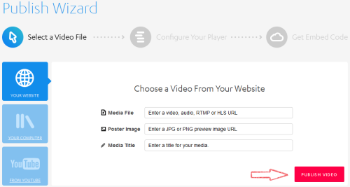
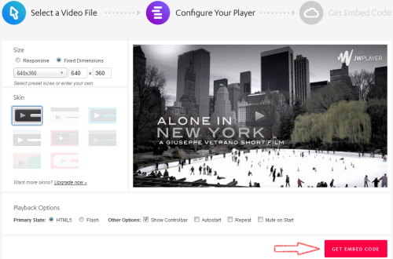
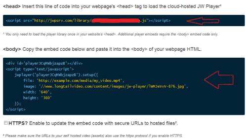
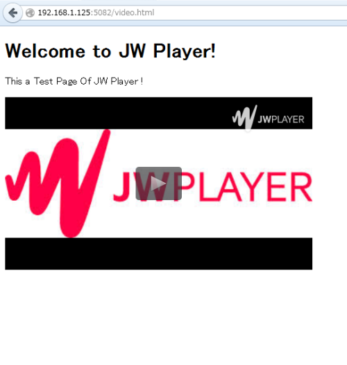

JW Player - Red5 弄る
########################

:title: JW Player - Red5 弄る
:date: 2014-09-11 20:00
:category: 整理
:tags: 流媒体
:author: Hanbin

JW Player
==========

JW Player是一个在线媒体播放器,可以利用Adobe Flash或HTML5来
在线播放FLV、H264(AVC)编码的MP4等，可免费使用（右上角会有水印），
作为一个成熟产品，后续支持也非常丰富，具体可参加见官方网页：

[http://support.jwplayer.com/](http://support.jwplayer.com/)

在自己的网页中播放视频
----------------------

打开 [http://www.jwplayer.com/sign-up/](http://www.jwplayer.com/sign-up/)

填入邮箱，点击获取按钮，随后将会收到确认邮件。
确认并注册成功后将出现如下窗口：

.. figure:: ./resource/img/JWPlayerRed5/1.png
  :alt: alternate text
  
点击“PUBLISH A VIDEO NOW”按钮进入如下界面：

  
左面的“YOUR WEBSITE”,“YOUR COMPUTER”,“FROM YOUTUBE”  
是指音视频或图片文件的来源，  
以“YOUR WEBSITE”为例，右半部分分别用来指定  
音视频文件的URL， 播放前的起始画面， 名字。  
填入的目的是用来生成代码，这里可以全部空白，稍后在代码中修改。

点击“PUBLISH VIDEO”按钮来到下面的界面：

这里可以指定播放器的大小和皮肤等参数，也可以在代码中修改，
点击“GET EMBED CODE”就可以生成我们定制的代码了。如下图：

在自己网页的Hade，Body中分别加入上述代码，重新载入试试看吧。

很简单对吧！

下载到本地
----------

上述生成的代码实际上是调用了JWPlayer放在云端的播放器，
当然也可以将它下载到本地。

先打开上文第一张图片所在的页面，
点击“Get Your Player”,出现如下页面，

.. figure:: ./img/JWPlayerRed5/6.png
  :alt: alternate text

分别给出了在线播放器调用地址，本地播放器使用的许可，本地播放器下载地址。
下载解压后放到服务器中，并在网页中指定播放器地址与许可即可。

.. code-block:: Javascript

    head:  
    
    

    body:  
    
Loading the player...

    

Red5
====

待补充

本文环境：
  Debian 7.3
  Nginx 1.6
  JW Player 6.10
  Red5 1.0

以上。
