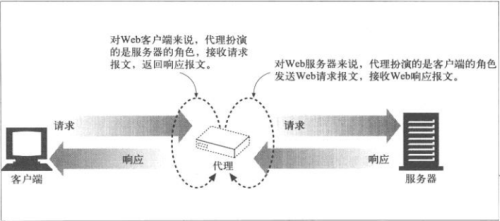
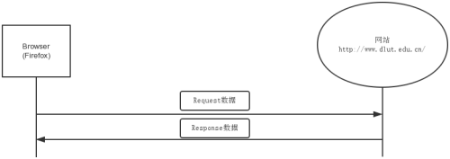
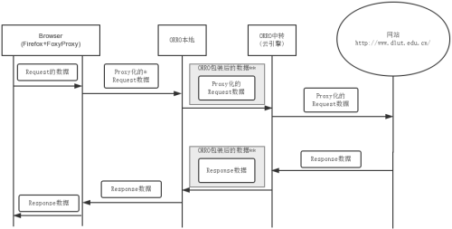
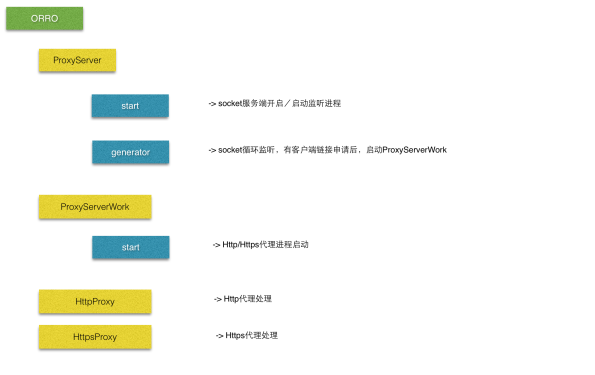

学习写个代理工具-ORRO (1)
##############################

:title: 学习写个代理工具-ORRO (1)
:date: 2014-12-16 21:00
:category: 项目
:tags: ORRO, 代理, Python
:author: Hanbin

------

** 项目托管在https://github.com/lixingke3650/ORRO **

包含以下几篇文章
> 学习写个代理工具-ORRO (1)　　－　起因，构成
> 学习写个代理工具-ORRO (2)　　－　学习到的HTTP头知识
> 学习写个代理工具-ORRO (3)　　－　部署

------

代理
====

在网络加速，科学上网等时候经常会碰到代理这个词，
代理就是好像是一个中转站，如果从大连没有直飞到
日本的飞机，或者航班数较少，那么可以借由北京中转一下。

网络上的代理也是一样，从你个人的节点无法到达要访问的
节点，或你们之间直连的速度较慢时，就可借助另外一个
中转节点来实现互通。

代理的思想很易懂，但具体到场合，工具，用途等，会
出现很多种实现方法。

最近自己以科学上网为目标学习写一个代理工具，将过程和用到的
知识记录如下。

------

ORRO
====

ORRO，我给起的名字，目标是成为一个Http代理工具。
实现方法和Goagent大致相同，以云引擎为中转。

云引擎支持的语言不算多，常见的Java，Python，Ruby这几种。
选Python吧。没Java那么臃肿，语言风格也大体比较喜欢，关键还很强大。
(就是觉得self比较麻烦)

因为是网页代理，可能Http协议用的比较多，提前掌握一下比较好。

编写代码与测试环境很重要。
Sublime Text2，UI漂亮，用起来非常流畅，用来做代码编辑器。

测试环境本地使用Firefox+FoxyProxy+Python2.7.8,
云引擎使用OpenShift，免费，功能也多。

不过云端上传代码费时，调试也不方便，
自己搭一个Python　Web服务器吧。
(Debian7.3+Nginx1.6.0+Gunicorn19.1.1+Python2.7.3)

工欲善其事，必先利其器。开发与调试环境真的很重要^_^

OK，开工。

------

总体印象
--------

关于代理服务器的理解，HTTP权威指南上有这样一个易懂的图：
(如侵犯到您的版权，请联系我。)

可以看到，无论客户端还是服务端，都没有必要知道中间是否经过了代理，
也就是说，代理内部无论怎样处理，只要保证入口和出口的一致性即可。
  
看下图(借用母校的网址来说明)，

正常的网站访问流程很简单，直接由浏览器发出请求，
网站服务器接到请求后，返回结果即可。
(当然中间会经过各种传输层，网络层啊等概念，不过http代理工作在应用层，
基本不涉及下层协议)

加入代理后，流程稍显复杂，需要注意的有以下几点：

1.

首先原始的请求信息会被加上代理的标志(由浏览器自身或FoxyProxy完成)后
发送出去。
这里说的代理标志主要是指Http头信息的请求地址会改写为完整路径。

2.

数据被发往本地的ORRO服务。
本地ORRO接到数据后，做一些私有的格式化处理，比如加密什么的，
然后发送到远端的ORRO服务，即云引擎上的ORRO服务。
理论上本地ORRO与远端ORRO之间可以完全自由的对数据进行私有格式处理，
但由于远端ORRO服务要存放在云引擎上面，受到云引擎的限制，因此
在这里本地ORRO与远端ORRO之间以Http的形式进行通信。

3.

远端ORRO服务接到数据后进行去格式化处理，比如解密什么的，
获得原始的请求信息，并从中提取出目标网站的网络地址，为后续建立连接做好准备。

4.

远端ORRO服务向目标网站(服务器)发出请求并获取应答，
对应答进行私有格式处理后，返回给本地ORRO。

5.

本地ORRO接到数据后去格式化处理，返回给浏览器等本地应用。

本地ORRO服务
------------

经上述分析可以知道，ORRO服务需要本地和云端(远端)两个部分组成。
本地服务接受浏览器等应用发送来的请求，并转发给远端ORRO。
(后面都以Firefox+FoxyProxy作为本地应用来说明)
等待并接收Firefox+FoxyProxy请求需要一个Socket　Server，
而访问远端ORRO需要一个Socket　Client。

本地Socket Server
------------------

给定本地IP地址打开端口并监听即可。
本地IP通常指定为127.0.0.1，
端口在1024到65535之间，并与其他应用不冲突即可。
(0~1024大部分为系统或保留端口，还是别碰为好)
以访问大连理工大学的主页为例，来分析一下Http请求。

抓取Http请求头如下：

::

  GET http://www.dlut.edu.cn/ HTTP/1.1
  Host: www.dlut.edu.cn
  User-Agent: Mozilla/5.0 (Windows NT 6.1; rv:34.0) Gecko/20100101 Firefox/34.0
  Accept: text/html,application/xhtml+xml,application/xml;q=0.9,*/*;q=0.8
  Accept-Language: ja,en-us;q=0.7,en;q=0.3
  Accept-Encoding: gzip, deflate
  Connection: keep-alive

**对于GET请求，本地ORRO服务并不关心内容，打包发送给云端ORRO即可。**

::

  POST http://www.dlut.edu.cn/xuexiaogaikuang/ssjg.jsp?wbtreeid=1002 HTTP/1.1
  Host: www.dlut.edu.cn
  User-Agent: Mozilla/5.0 (Windows NT 6.1; rv:34.0) Gecko/20100101 Firefox/34.0
  Accept: text/html,application/xhtml+xml,application/xml;q=0.9,*/*;q=0.8
  Accept-Language: ja,en-us;q=0.7,en;q=0.3
  Accept-Encoding: gzip, deflate
  Referer: http://www.dlut.edu.cn/
  Cookie: JSESSIONID=9C61B7FB977EEA60CACCD7656CE06F78
  Connection: keep-alive
  Content-Type: application/x-www-form-urlencoded
  Content-Length: 76
  
  Find=find&entrymode=1&INTEXT2=YWE%3D&news_search_code=&wbtreeids=0&INTEXT=aa

**对于POST请求，本地ORRO服务读取并转发完头部信息后还要读取转发Body信息，而Body的长度需要根据头部的Content-Length字段来确定。**  

在ORRO系统中，使用HTTP　POST将上述收到的请求发送到远端服务器。
以上述GET请求为例，经ORRO包装后发送给远端的数据如下：

::

  POST http：//orro_remote.com/ORRO_HTTP/ HTTP/1.1
  Host: orro_remote.com
  Connection: keep-alive
  Content-Length: 311
  
  GET http://www.dlut.edu.cn/ HTTP/1.1
  Host: www.dlut.edu.cn
  User-Agent: Mozilla/5.0 (Windows NT 6.1; rv:34.0) Gecko/20100101 Firefox/34.0
  Accept: text/html,application/xhtml+xml,application/xml;q=0.9,*/*;q=0.8
  Accept-Language: ja,en-us;q=0.7,en;q=0.3
  Accept-Encoding: gzip, deflate
  Connection: keep-alive
  
ORRO头部的Content-Length是请求内容全部数据的大小，也是本次POST的body的大小。
远端服务可以完整的取到请求内容。

另外，无论GET还是POST，头部中Connection字段的处理都非常重要。
Connection是服务端与客户端之间是否保持Socket长连接的标志。
如果是本地代理，那么该标志可以与Firefox+FoxyProxy的请求头内容完全一致，
但ORRO的远端服务是运行在云端的，也就是说socket的连接是难以把控的，
初期的ORRO会将此标志主动设为close，即完成一次请求并返回结果后，ORRO将关闭
与Firefox+FoxyProxyhe连接。新的请求将产生新的socket连接。

不管怎样看，Http头处理都是不可避免的。于是写了一个Http头处理工具，

(https://github.com/lixingke3650/ORRO/blob/master/Local/Tool/HttpHead.py)

可以获取指定字段值，删除字段，增加字段，更改字段等。

Firefox+FoxyProxy发出的请求并不同步，同一时间可能会有大量连接到来。
多线程处理是必不可少的。

组织结构如下图：

  
本地Socket　Client
--------------------

访问云端的ORRO服务可以有两种方法：

* 以访问web服务器的形式，可以利用现有的各类工具
* 用最基本的socket来访问

ORRO采用第二种方法，因为本身只有POST一种方式，
且没有复杂的参数，采用socket还可以实现精确的控制。
从配置文件中取得远端ORRO的Host与端口(云服务器可能只开放了80端口来解析各类脚本)
接收到Firefox+FoxyProxy请求后即连接远端Socket发送数据。
远端数据接收处理后发送给Firefox+FoxyProxy，并断开与远端Socket的连接。
  
需要注意的地方
----------------

请求的URL
''''''''''

通常情况下，请求的URL如下：
::

  GET / HTTP/1.1
  Host: www.dlut.edu.cn

而Firefox+FoxyProxy会使用完整的URL：
::

  GET http://www.dlut.edu.cn/ HTTP/1.1
  Host: www.dlut.edu.cn

大部分网站对上述两种写法都会返回正确的结果，
但个别网站会出现问题，
经个人测试百度与优酷对完整的URL会返回错误。
(也可能是个人的测试问题，
标准协议中请求URL是不含有前面的Host信息的。)

因此，要去掉Firefox+FoxyProxy请求中的完整URL信息。

Http头
''''''

Http代理对Http头信息是有相当敏感性的，
不同的头部可能对应了代理服务器的不同动作。
ORRO虽然与一个完整的代理服务器还有相当大的差距，
但仍然不可避免的要处理一些头信息。
这些将在[写个代理工具-ORRO(2)]中来介绍。

以上。

20141216

海阔凭鱼跃，天高任鸟飞。