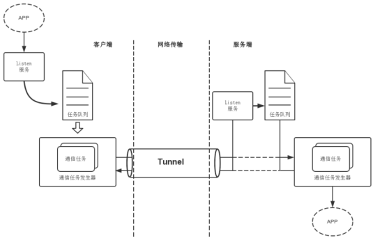

网络安全通信隧道-OrTunnel
##############################

:title: 网络安全通信隧道-OrTunnel
:date: 2015-03-03 22:00
:category: 项目
:tags: tunnel, SSL, TLS, RC4, OrTunnel
:author: Hanbin

------

网络安全这个东西，
说他重要可在某些时候都感觉不到他的存在；
说他不重要可在某些时候却能要了我们的命。

OrTunnel为不具有安全传输的应用增加了
在网络上安全传输数据的功能。

代码托管在
https://github.com/lixingke3650/OrTunnel

------
  
起因
====

在写代理工具[ORRO][2]时,发现本地服务器与远程服务器
之间的通信是明文的，这在科学上网的时候很容易被绊。
代理失败不说还很容易被封端口封IP。
开始时打算在代理内部增加加解密的功能，后来想了一想，
单独做成一个工具可能更易去学习理解，
也不至于使ORRO变得臃肿而失去继续下去的兴致。
于是学习写了一个安全传输隧道工具-OrTunnel。

调查
====

之前工作中使用C和OpenSSL写过网络安全通信方面的项目，
对SSL有过一些了解，所以首先想到的是用SSL来实现安全隧道。
SSL协议是一系列安全通信的约束，我们也可以直接使用加密算法
加密数据，这样更有助于理解安全通信的过程。

概要/参数
==========

我希望这个工具写完以后不但可以学习，增长知识，也能真正的去使用他。
所以稳定性与性能也被考虑了进去。

::

    > 多线程，多条隧道可同时通信  
    > 提供SSL/TLS加密通信方式  
    > 提供RC4加密通信方式  
  
本想加入socket断线检测功能，后来觉得即便不加入OrTunnel，
也会存在因网络状况导致的断线，所以若通讯中发生断线则如实的
传递给应用，由应用重新发起链接比较好。
实现语言：Python，实现平台：Python支持的平台。

实现过程
========

分客户端与服务端两部分实现。
两部分的内部处理大致相同。

客户端
------

客户端分为 **监听服务** 和 **通信服务** 两部分。

**监听服务** 启动后监听端口，发现有应用发起的链接，
实例化一个作业任务，设置该应用链接的socket，
并将该作业任务加入作业任务队列。

**通信服务** 启动后阻塞读取作业任务队列，
发现新任务则新建线程连接服务端，开始数据交换。
主线程将作业任务从作业任务队列中删除，
继续阻塞读取作业任务队列。

**加解密** 处理可根据设定文件指定的方式来进行，
读取到应用的数据好先加密，在发往服务端，
读取到服务端数据后，先解密在发往应用。

服务端
------

服务端处理与客户端相似。
主要区别就是SSL认证。
目前OrTunnel采用的是客户端认证的方式，
服务端不认证客户端的合法性。

注意项
------

除了SSL通信外，还实现了RC4加密通信，好处就是加解密速度快，消耗资源少。

起初利用PyCrypto这个第三方库来实现，
发现总是随机性的出现乱码，
于是查资料自己实现，结果仍然是乱码。

不过实现RC4加密的过程中知道加密解密用的密钥SBox是
随加解密过程而动态变化的，
**如果网络通信中出现socket分包粘包的情况，
原有的处理会出现加解密密钥不同步的情况，进而导致解密失败。**

修改以后PyCrypto和自己实现的RC4加解密模块都可以稳定工作。

后续
====

暂无。

以上。

20150303

敌人是强大的，我们唯有比他更强大才能战胜他；

敌人是顽固的，我们唯有比他更顽固才能战胜他；

敌人是狡黠的，我们唯有比他更狡黠才能战胜他；

敌人是无耻的，...

好吧，3比1我们赢了。
