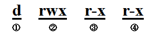

Linux文件权限介绍
######################

:title: Linux文件权限介绍
:date: 2015-12-02 20:00
:category: 整理
:tags:
:author: Hanbin

..:Summary: Linux文件权限介绍

linux下 ls -l 命令查看目录(准确说应该是文件描述符)总会出现类似于 **drwxr-xr-x** 的内容，即文件(目录)权限说明。
那字符的具体含义和设置方法是什么呢？

--------------

结构
====

文件权限说明字串共10位字符，分为四组。详见下图：

① 第一位字符表示该对象类别，常有如下类型：

    +------+---------+
    | 字符 | 含义    |
    +======+=========+
    | d    | 目录    |
    +------+---------+
    | －   | 文件    |
    +------+---------+
    | l    | (软)链接|
    +------+---------+
    | b    | 块设备  |
    +------+---------+
    | c    | 字符设备|
    +------+---------+
    | s    | socket  |
    +------+---------+
    | p    | 命名管道|
    +------+---------+

②③④ 从第二位开始，每三个字符为一组，一组中第一位为读权限，第二位为写权限，第三位为执行权限。可设置的值见下表：

    +--------+--------+--------+
    |        | 允许   |   拒绝 |
    +========+========+========+
    | 第一位 |  r     |    －  |
    +--------+--------+--------+
    | 第二位 |  w     |    －  |
    +--------+--------+--------+
    | 第三位 |  x     |    －  |
    +--------+--------+--------+

第一组(2~4)表示该文件描述符所有者的权限;

第二组(5~7)表示与该文件描述符所有者处于同一用户组的用户所持有的权限;

第三组(8~10)表示上述意外的用户所持有的权限.

设定、变更可以通过 **chmod** 命令实现。

例如，想要自己拥有r/w/x权限，而其他所有用户只拥有r权限，则可以执行 **chmod 0744 file** 来实现。

除了r/w/x还有特殊权限 **S** 和 **T** .

S只针对文件有效，让一般使用者临时具有该文件所属主/组的执行权限。

T只针对目录有效，用来控制该目录内文件的删除(重命名/移动)。

上例中0744最前面的 **0** 是设定特殊权限的。0表示不使用任何特殊权限，该位上的数字可以是0,1(--t),2(-s-),3(-st),4(s--),5(s-t),6(ss-),7(sst).

以上。

20151202

退屈
