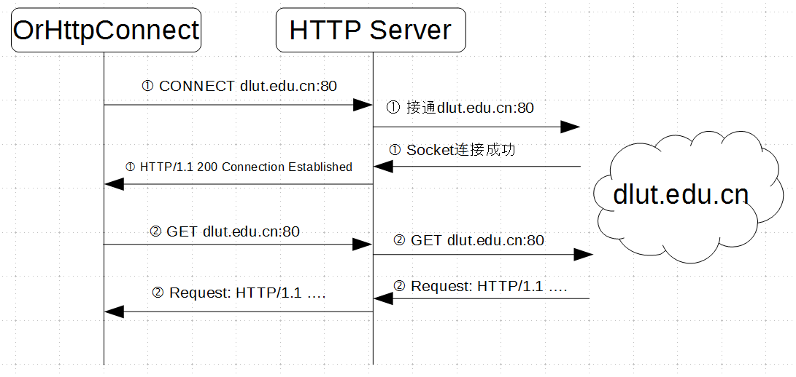

HTTP服务器穿透-OrHttpConnect
#################################

:title: HTTP服务器穿透-OrHttpConnect
:date: 2016-11-03 20:00
:category: 项目
:tags: HTTP
:author: Hanbin

.. :Summary: OrHttpConnect

因为公司内部防火墙，没法自由的连接外网，只能通过HTTP服务器来访问允许的网站。
好在，HTTP服务器开了CONNECT。自己写了一个工具，利用它配合HTTP服务器的CONNECT就可以穿透防火墙了。

代码托管在： 
https://github.com/lixingke3650/OrHttpConnect

--------------

CONNECT
========

CONNECT是HTTP协议的一个方法，简单来说就是让HTTP服务器充当一个中间人，用它向外来发起你想要连接。HTTPS也是利用这个方法来建立通信的。
简单的请求头如下：

.. code-block:: Text

    CONNECT www.dlut.edu.cn:80 HTTP/1.1
    Host: dlut.edu.cn:80
    Proxy-Connection: Keep-Alive
    Proxy-Authorization: Basic *
    Content-Length: 0

“Proxy-Authorization: Basic \*”中的“\*”是登陆HTTP服务器用的验证信息，包含用户名密码，格式是 ： name:password, 并且需要用basic进行编码。
HTTP服务器接收请求并链接到指定的目的地后会返回包含 **“HTTP/1.1 200 Connection Established”** 的应答，否则返回一个 **“Unauthorized”**。

OrHttpConnect
==============

OrHttpConnect这个工具可以告诉HTTP服务器帮我连接到哪里，联通以后HTTP服务器就成了一个传话员。
另外，CONNECT本身并没有加密功能，所以HTTP服务器虽然会忠于职守的帮我们转发数据，但有可能也会偷窥我们谈话内容，所以有特殊要求的同学，请使用别的方法来加密通信。

原理很简单，实现方法套用了之前OrTunnel的结构。
通信过程可参考下图：

嗯，就这些吧。
以上。

20161103

越来越懒。。